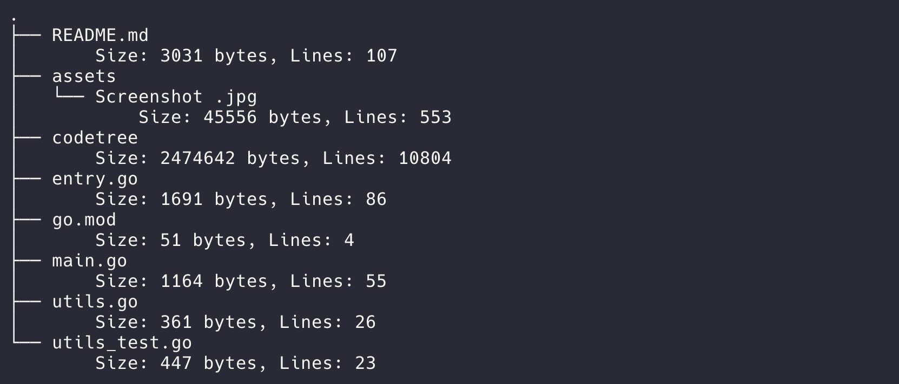

# Code Tree Generator

This tool generates a tree structure of a directory, similar to the `tree` command. It provides several options, including displaying additional file information, ignoring specified folders, and outputting results to a file.

## Features

- **Tree Structure Generation**: Recursively displays the directory structure in a tree format.
- **Verbose Output**: Shows file sizes and line counts when the `-v` flag is used.
- **Ignore Specific Folders**: Skip specified folders using the `--ignore` flag.
- **Output to File**: Save the output to a file using the `-o` flag.

## Usage

To run the tool, use the following command:

```sh
go run main.go [-v] [--ignore=folder1,folder2] [-o output_file] <directory_path>
```

### Arguments and Options

- `<directory_path>`: The path to the directory you want to generate the tree for.
- `-v`: (Optional) Enable verbose output to show the size and line count of each file.
- `--ignore`: (Optional) Comma-separated list of folder names to ignore.
- `-o`: (Optional) File to save the output instead of printing it to the console.

## Examples

### Generate a simple tree structure:
```sh
go run main.go /path/to/directory
```

**Sample Output:**


### Generate a tree structure with verbose output:
```sh
go run main.go -v /path/to/directory
```

**Sample Output:**



### Ignore specific folders (`node_modules` and `.git`):
```sh
go run main.go --ignore=node_modules,.git /path/to/directory
```

### Save output to a file:
```sh
go run main.go -o output.txt /path/to/directory
```

## Output

The output will display the directory structure in a tree format. If the `-v` flag is used, it will also show the size and number of lines for each file. The output can either be printed to the console or saved to a file when the `-o` flag is used.

## Installation

To install the tool, clone the repository and build the Go project:

```sh
git clone <repository_url>
cd <repository_directory>
go build -o codetree
```

## Using as a Script

To build the tool and use it as a script, run the following command:

```sh
go build -o codetree
```

This will create an executable named `codetree` in the current directory. You can then run the tool using:

```sh
./codetree [-v] [--ignore=folder1,folder2] [-o output_file] <directory_path>
```

## Adding an Alias

To make it easier to run the tool, you can add an alias to your shell configuration file.

For Linux and macOS, add the following line to your `~/.bashrc` or `~/.zshrc` file:

```sh
alias codetree='/path/to/codetree'
```

Replace `/path/to/codetree` with the actual path to the `codetree` executable. After adding the alias, reload your shell configuration:

```sh
source ~/.bashrc  # For bash
source ~/.zshrc   # For zsh
```

Now you can run the tool using the `codetree` command:

```sh
codetree [-v] [--ignore=folder1,folder2] [-o output_file] <directory_path>
```

## License

This project is licensed under the MIT License. See the [LICENSE](LICENSE) file for details.